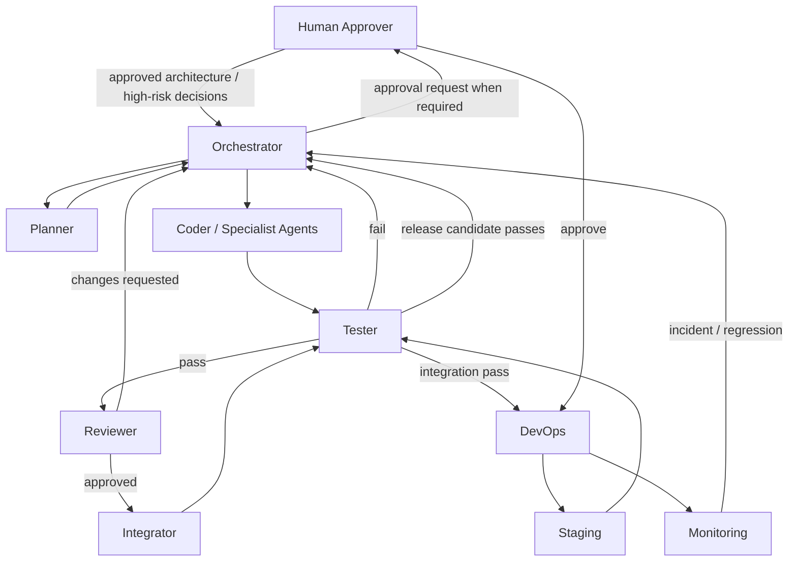

# MATRIX — Autonomous AI Development Architecture

**Status:** Operating-model baseline  
**Purpose:** Define how autonomous AI agents plan, implement, test, review, integrate, and prepare MATRIX for deployment with minimal human intervention.

This folder governs **how MATRIX is built**.

The separate MATRIX V1 product-architecture folder governs **what MATRIX must become**.

## Core model



## Core principles

1. **Architecture is authoritative.** Agents implement approved architecture; they do not silently redesign it.
2. **No self-approval.** An agent that materially changes production code cannot be the sole authority that approves that change.
3. **Small scoped tasks.** Work is decomposed into bounded tasks with dependencies and acceptance criteria.
4. **Persistent state.** Project progress must live in files, Git, tests, and logs—not only in conversation memory.
5. **Human attention is scarce.** Escalate only architectural, destructive, security-sensitive, cost-sensitive, or production-impacting decisions.
6. **The AI VM is resource constrained.** Persistent data and large artifacts live remotely; agents must protect disk space.
7. **Tests are gates, not suggestions.**
8. **Main is protected.** Agents do not directly commit arbitrary work to production branches.
9. **Secrets never enter Git.**
10. **Failure should be recoverable.** A crashed agent or VM restart must not erase project state.

## Folder map

```text
MATRIX_AI_Development_Architecture/
├── README.md
├── AGENTS.md
├── 01_ORCHESTRATION_MODEL.md
├── 02_TASK_PLANNING_PROTOCOL.md
├── 03_AGENT_ROLES.md
├── 04_GIT_WORKFLOW.md
├── 05_TEST_REVIEW_GATES.md
├── 06_HUMAN_APPROVAL_POLICY.md
├── 07_PERSISTENT_STATE.md
├── 08_RESOURCE_GUARDRAILS.md
├── 09_FAILURE_RECOVERY.md
├── 10_SECURITY_AND_SECRETS.md
├── 11_AUTONOMOUS_EXECUTION_LOOP.md
├── 12_BOOTSTRAP_AND_HANDOFF.md
├── agents/
│   ├── ORCHESTRATOR.md
│   ├── PLANNER.md
│   ├── CODER.md
│   ├── TESTER.md
│   ├── REVIEWER.md
│   ├── INTEGRATOR.md
│   └── DEVOPS.md
└── .ai/
    ├── PROJECT_STATE.md
    ├── TASKS.json
    ├── DECISIONS.md
    ├── BLOCKERS.md
    ├── TEST_STATUS.md
    ├── DEPLOYMENT_STATUS.md
    └── RESOURCE_STATUS.md
```

## Source-of-truth hierarchy

When documents disagree, apply this order:

1. Human-approved architecture decisions / explicit approvals
2. MATRIX product architecture
3. `AGENTS.md`
4. This AI-development architecture
5. Role-specific agent files
6. Task definitions
7. Agent implementation preferences

An agent must not resolve a higher-level conflict by silently choosing a lower-level instruction.

## Starting point

The first orchestrator run must:

1. locate the MATRIX product-architecture folder;
2. read the product `README.md` and architecture decision file;
3. read this `AGENTS.md`;
4. read `01_ORCHESTRATION_MODEL.md` through `12_BOOTSTRAP_AND_HANDOFF.md`;
5. load `.ai/PROJECT_STATE.md` and `.ai/TASKS.json`;
6. validate repository and resource state;
7. ask the Planner for a task DAG;
8. persist that DAG before implementation begins.
