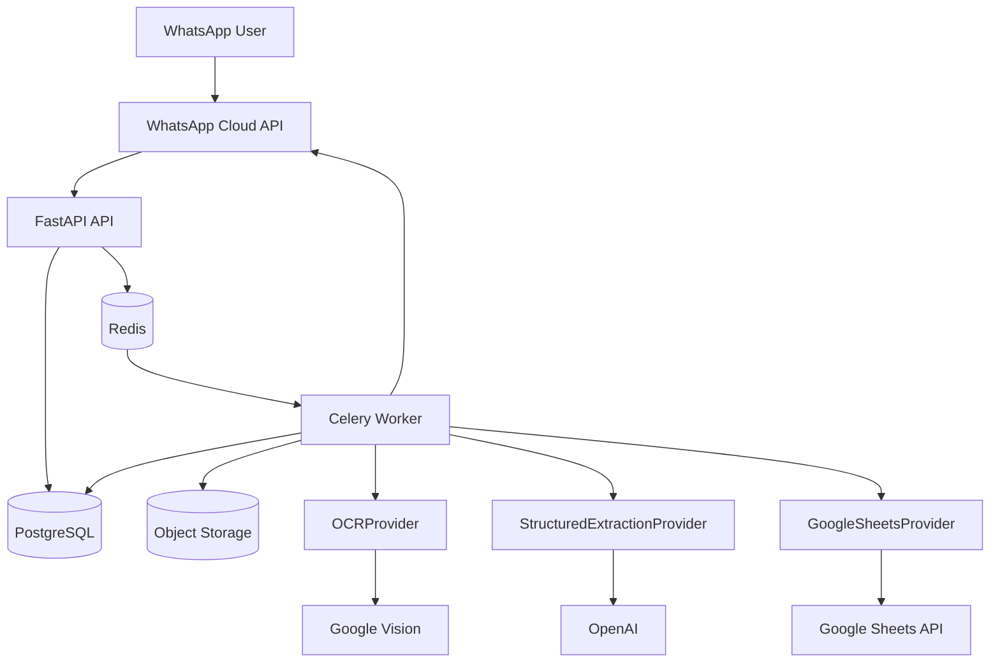

# 02 — System Architecture

## 1. Logical architecture



## 2. Runtime components

### API container
Responsibilities:
- WhatsApp webhook verification;
- incoming webhook parsing;
- idempotency checks;
- lightweight persistence;
- enqueue background processing;
- health/readiness endpoints;
- internal read-only status endpoints.

Must not:
- perform OCR synchronously;
- invoke OpenAI synchronously in webhook path;
- perform Google Sheets sync synchronously in webhook path.

### Worker container
Responsibilities:
- media download;
- object storage upload;
- image validation;
- business-card classification;
- OCR;
- structured extraction;
- validation/normalization;
- duplicate resolution;
- database persistence;
- Google Sheets sync;
- outbound WhatsApp confirmation;
- retryable failure handling.

### Redis
Responsibilities:
- Celery broker;
- optional short-lived idempotency/cache keys.

Not the source of truth.

### PostgreSQL
Responsibilities:
- system of record;
- scan state;
- contacts;
- companies;
- contact methods;
- integrations;
- sync history;
- webhook event ledger.

### Object storage
Responsibilities:
- original business-card images;
- optional derived/preprocessed images later.

## 3. Trust boundaries

```text
Internet
  ├── Meta WhatsApp API
  ├── Google Vision
  ├── OpenAI
  └── Google Sheets API

MATRIX application boundary
  ├── FastAPI
  ├── Celery
  ├── Redis
  └── application secrets

Persistent data boundary
  ├── PostgreSQL
  └── Object storage
```

## 4. Provider boundary rule

Core application code must depend on interfaces, not vendor SDKs.

Bad:

```python
from google.cloud import vision
# used directly inside contact service
```

Good:

```python
result = await ocr_provider.extract_text(image_ref)
```

Only the provider implementation knows the vendor SDK.

## 5. Tenancy

Every business-domain record that can belong to different customers must carry `organization_id`.

V1 may operate with one organization, but code and schema must not assume a global singleton organization.

## 6. Source-of-truth rule

- PostgreSQL = canonical source of truth.
- Google Sheets = projection/integration destination.
- Redis = ephemeral coordination.
- Object storage = canonical binary store for card images.
- External provider responses = stored only when useful for audit/debugging and subject to privacy constraints.
