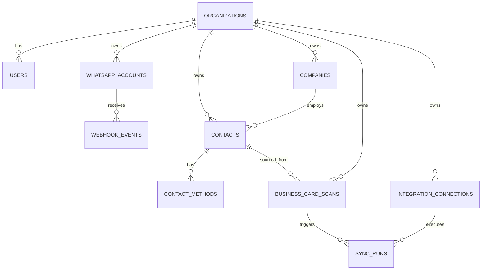

# 03 — PostgreSQL Data Model

## 1. Entity overview



## 2. Core tables

### `organizations`
- `id UUID PK`
- `name TEXT NOT NULL`
- `status TEXT NOT NULL DEFAULT 'active'`
- `created_at TIMESTAMPTZ`
- `updated_at TIMESTAMPTZ`

### `users`
- `id UUID PK`
- `organization_id UUID FK`
- `display_name TEXT`
- `email TEXT`
- `whatsapp_phone_e164 TEXT`
- `role TEXT`
- `created_at`
- `updated_at`

V1 may bootstrap one user through configuration rather than a UI.

### `whatsapp_accounts`
- `id UUID PK`
- `organization_id UUID FK`
- `phone_number_id TEXT NOT NULL`
- `business_account_id TEXT`
- `display_phone_number TEXT`
- `is_active BOOLEAN`
- `created_at`
- `updated_at`

Secrets/tokens must not be stored here in plaintext. Use secret storage/environment injection.

### `webhook_events`
Purpose: durable idempotency ledger.

- `id UUID PK`
- `organization_id UUID FK nullable until resolved`
- `provider TEXT NOT NULL DEFAULT 'whatsapp'`
- `provider_event_id TEXT NOT NULL`
- `event_type TEXT`
- `payload JSONB NOT NULL`
- `received_at TIMESTAMPTZ`
- `processing_status TEXT`
- `error_code TEXT`
- `error_message TEXT`

Constraint:
```sql
UNIQUE(provider, provider_event_id)
```

### `business_card_scans`
- `id UUID PK`
- `organization_id UUID FK NOT NULL`
- `contact_id UUID FK NULL`
- `webhook_event_id UUID FK NULL`
- `whatsapp_message_id TEXT`
- `source_user_phone_e164 TEXT`
- `object_key TEXT NULL`
- `mime_type TEXT`
- `file_size_bytes BIGINT`
- `sha256 TEXT`
- `raw_ocr_text TEXT`
- `ocr_provider TEXT`
- `ocr_confidence NUMERIC NULL`
- `extracted_json JSONB`
- `normalized_json JSONB`
- `classification TEXT`
- `classification_confidence NUMERIC NULL`
- `status TEXT NOT NULL`
- `failure_code TEXT NULL`
- `failure_detail TEXT NULL`
- `created_at`
- `updated_at`
- `completed_at`

Recommended statuses:

```text
received
media_downloaded
stored
validated
rejected_not_business_card
ocr_complete
extracted
validation_failed
normalized
duplicate_resolved
contact_saved
sync_pending
completed
needs_retry
failed
```

### `companies`
- `id UUID PK`
- `organization_id UUID FK NOT NULL`
- `name TEXT NOT NULL`
- `normalized_name TEXT`
- `website TEXT`
- `industry TEXT`
- `description TEXT`
- `address TEXT`
- `extra_fields JSONB NOT NULL DEFAULT '{}'`
- `created_at`
- `updated_at`

Index:
- `(organization_id, normalized_name)`

### `contacts`
- `id UUID PK`
- `organization_id UUID FK NOT NULL`
- `company_id UUID FK NULL`
- `full_name TEXT NOT NULL`
- `first_name TEXT`
- `last_name TEXT`
- `normalized_full_name TEXT`
- `job_title TEXT`
- `department TEXT`
- `address TEXT`
- `notes TEXT`
- `extra_fields JSONB NOT NULL DEFAULT '{}'`
- `status TEXT NOT NULL DEFAULT 'active'`
- `created_at`
- `updated_at`

Indexes:
- `(organization_id, normalized_full_name)`
- `(organization_id, company_id)`

### `contact_methods`
Represents phones, emails, websites, social links.

- `id UUID PK`
- `organization_id UUID FK NOT NULL`
- `contact_id UUID FK NOT NULL`
- `kind TEXT NOT NULL`
- `label TEXT NULL`
- `value TEXT NOT NULL`
- `normalized_value TEXT NOT NULL`
- `is_primary BOOLEAN DEFAULT FALSE`
- `created_at`
- `updated_at`

Recommended `kind` values:
```text
phone
email
website
linkedin
x
instagram
facebook
other
```

Constraint:
```sql
UNIQUE(organization_id, kind, normalized_value)
```

For V1, this uniqueness constraint supports exact duplicate resolution. If product requirements later permit shared office numbers/emails, replace this with a weaker uniqueness strategy through a migration.

### `integration_connections`
- `id UUID PK`
- `organization_id UUID FK NOT NULL`
- `provider TEXT NOT NULL`
- `status TEXT NOT NULL`
- `external_account_ref TEXT`
- `config JSONB NOT NULL DEFAULT '{}'`
- `credential_ref TEXT`
- `created_at`
- `updated_at`

For Google Sheets, `config` may contain:
```json
{
  "spreadsheet_id": "...",
  "worksheet_name": "Contacts",
  "column_mapping": {
    "full_name": "Name",
    "company": "Company",
    "job_title": "Title",
    "primary_phone": "Phone",
    "primary_email": "Email",
    "website": "Website"
  }
}
```

`credential_ref` points to a secret manager or encrypted credential store; do not put refresh tokens directly into normal logs/config files.

### `sync_runs`
- `id UUID PK`
- `organization_id UUID FK NOT NULL`
- `integration_connection_id UUID FK NOT NULL`
- `scan_id UUID FK NULL`
- `contact_id UUID FK NOT NULL`
- `operation TEXT NOT NULL`
- `status TEXT NOT NULL`
- `attempt_count INT NOT NULL DEFAULT 0`
- `external_record_ref TEXT NULL`
- `error_code TEXT NULL`
- `error_message TEXT NULL`
- `created_at`
- `updated_at`
- `completed_at`

Recommended statuses:
```text
pending
running
succeeded
retrying
failed
```

## 3. Suggested SQLAlchemy model conventions

All models:
- UUID primary keys;
- timezone-aware timestamps;
- explicit foreign keys;
- explicit indexes;
- no implicit lazy loading in request-critical paths;
- JSONB for flexible metadata only;
- Alembic migrations required for schema changes.

## 4. Normalization rules

### Phone
- preserve original raw value in extraction artifact;
- canonicalize to E.164 where country can be inferred safely;
- never invent a country code when ambiguous;
- ambiguous phone values may remain normalized but not E.164.

### Email
- lowercase domain and local portion for duplicate matching;
- trim whitespace;
- reject syntactically invalid values from canonical contact methods but preserve them in extraction artifact if needed.

### Website
- normalize scheme/domain;
- preserve path if printed on card;
- avoid crawling the website in V1.

### Names
- trim whitespace;
- collapse repeated spaces;
- keep original spelling;
- do not infer ethnicity, gender, or honorifics.

## 5. Contact update policy

On duplicate:
- fill previously null canonical fields when new extraction is credible;
- do not automatically replace existing non-null values with conflicting new values;
- keep new scan linked to existing contact;
- record differences in logs/audit metadata for later review.

## 6. Migration policy

Every schema change requires:
- Alembic migration;
- downgrade path unless technically impossible;
- migration test;
- documentation update when the domain contract changes.
