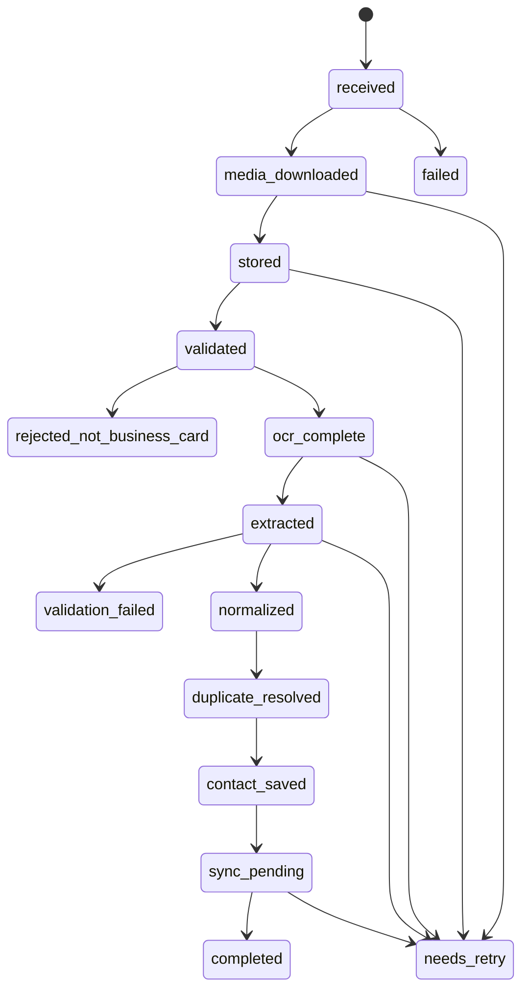

# 05 — Business Card Processing Pipeline

## 1. State machine



## 2. Detailed flow

### Step A — receive webhook
- Persist event idempotently.
- Identify image/media message.
- Resolve organization/WhatsApp account.
- Create `business_card_scans(status='received')`.
- Enqueue `process_business_card(scan_id)`.

### Step B — download media
Worker:
- request temporary media URL from Meta;
- download with timeout and max-size protection;
- reject unsupported media;
- compute SHA-256;
- persist mime type and byte size.

### Step C — store original image
- upload to private object storage;
- store object key, not public URL;
- object storage provider should return stable key/ref.

### Step D — validate image
Checks:
- allowed MIME types: JPEG, PNG, WEBP initially;
- non-zero dimensions;
- size within configured limit;
- decodable image;
- optional basic blur/quality heuristic.

### Step E — business-card classification
V1 implementation options, in preferred order:
1. use OCR/extraction response to classify;
2. use a lightweight multimodal classifier if needed;
3. avoid a separate expensive call unless justified.

Required classification contract:
```json
{
  "document_type": "business_card|document|receipt|photo|screenshot|unknown",
  "confidence": 0.0
}
```

Only `business_card` above a configured threshold continues automatically.

### Step F — OCR
Call `OCRProvider.extract_text()`.

Output contract:
```json
{
  "provider": "google_vision",
  "raw_text": "...",
  "confidence": 0.92,
  "language_hints": ["en"],
  "metadata": {}
}
```

Store `raw_ocr_text`.

### Step G — structured extraction
Pass OCR text plus limited context to `StructuredExtractionProvider`.

Do not ask for a prose summary as the primary artifact.

The model must return the canonical extraction schema.

### Step H — schema validation
Pydantic:
- type validation;
- URL/email cleanup;
- arrays normalized;
- unknown card-specific fields routed to `extra_fields`.

If schema fails:
- allow one repair/retry attempt when failure is provider formatting-related;
- otherwise mark `validation_failed`.

### Step I — normalize
Produce normalized values for:
- name;
- phones;
- emails;
- company;
- URLs.

Persist both:
- `extracted_json` = provider-structured output;
- `normalized_json` = application-normalized output.

### Step J — minimum quality gate
Require:
- full name;
- at least one meaningful identifier/company/website.

If not:
- mark `needs_retry`;
- send user retake message;
- do not create canonical contact.

### Step K — duplicate resolution
Search in organization:
1. normalized email exact;
2. normalized phone exact;
3. normalized full name + normalized company exact.

Result:
```text
new_contact
existing_contact_exact
possible_duplicate
```

For V1, `possible_duplicate` without strong identifier should create a new contact only if configured; default to avoiding destructive merge.

### Step L — persist contact
Within a database transaction:
- get/create company;
- get/create/update contact;
- insert contact methods;
- link scan to contact;
- set scan status `contact_saved`.

### Step M — sync integrations
Enqueue or execute dedicated `sync_contact_to_google_sheets` task.

A Google Sheets failure:
- must not delete the contact;
- must persist `sync_runs`;
- should retry independently.

### Step N — notify user
After canonical contact save:
- send confirmation with extracted fields;
- include Sheets sync result if already known;
- if sync remains in progress, it is acceptable to send contact confirmation first and sync status later.

## 3. Failure classes

### Permanent
Examples:
- unsupported file;
- clearly not a business card;
- no meaningful text;
- invalid destination configuration.

Do not endlessly retry.

### Transient
Examples:
- provider timeout;
- 429 rate limit;
- 5xx provider error;
- network interruption;
- Redis temporary failure.

Retry with bounded exponential backoff.

## 4. Retry principle

A retry must be safe.

Tasks must be written so replay does not:
- create duplicate contacts;
- append duplicate Sheet rows;
- send repeated user confirmations unintentionally.

Use database state and idempotency keys to enforce this.
